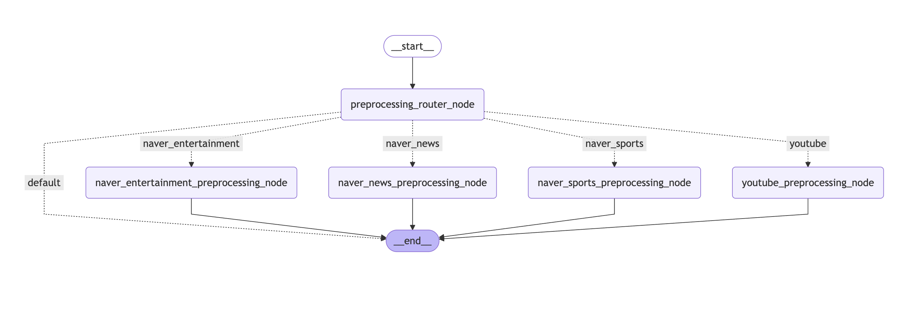
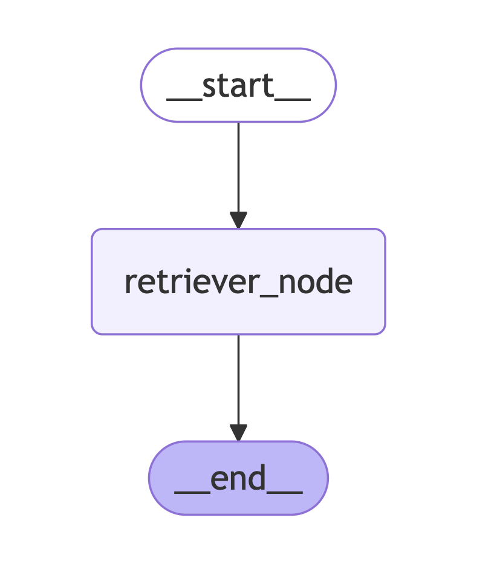
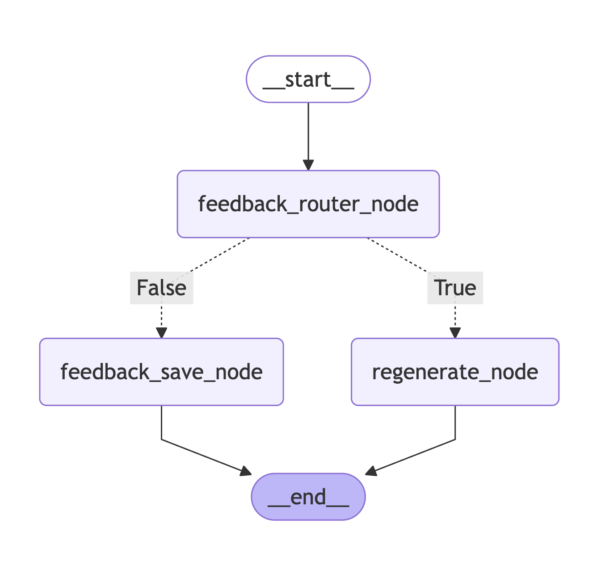

# SAE-Multi-Agents

## Repository Structure

```text
dev/
├── src: contains source code of demo agents in colab
└── static: contains pictures of flows
service/
└── langgraph_rag_api_mvp_v1
```

## DEV

`preprocessing_flow_graph`



`rag_flow_graph`



`feedback_flow_graph`



## Service